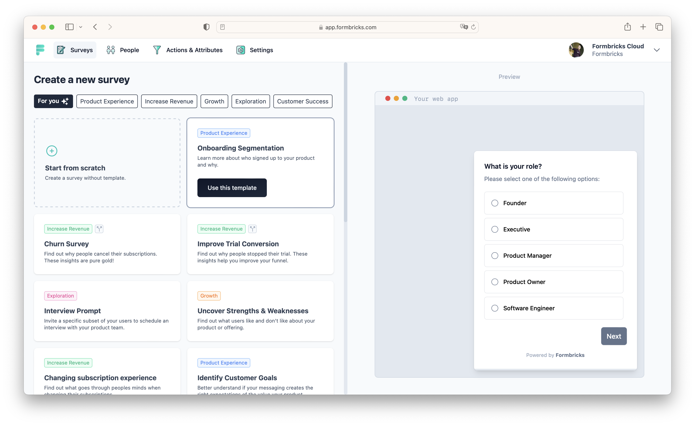

# Formbricks CI/CD pipeline

Deploy Formbricks server with CI/CD on Elestio

 
 

# Once deployed ...

You can open Formbricks here:

    URL: https://[CI_CD_DOMAIN]
    email: [ADMIN_EMAIL]
    password: [ADMIN_PASSWORD]

You can open pgAdmin web UI here:

    URL: https://[CI_CD_DOMAIN]:8443
    email: [ADMIN_EMAIL]
    password: [ADMIN_PASSWORD]

# Quick start

You can get started with Formbricks by following : <a href="https://www.youtube.com/watch?v=9c8v3hAxaWk" target="_blank">this video</a>
